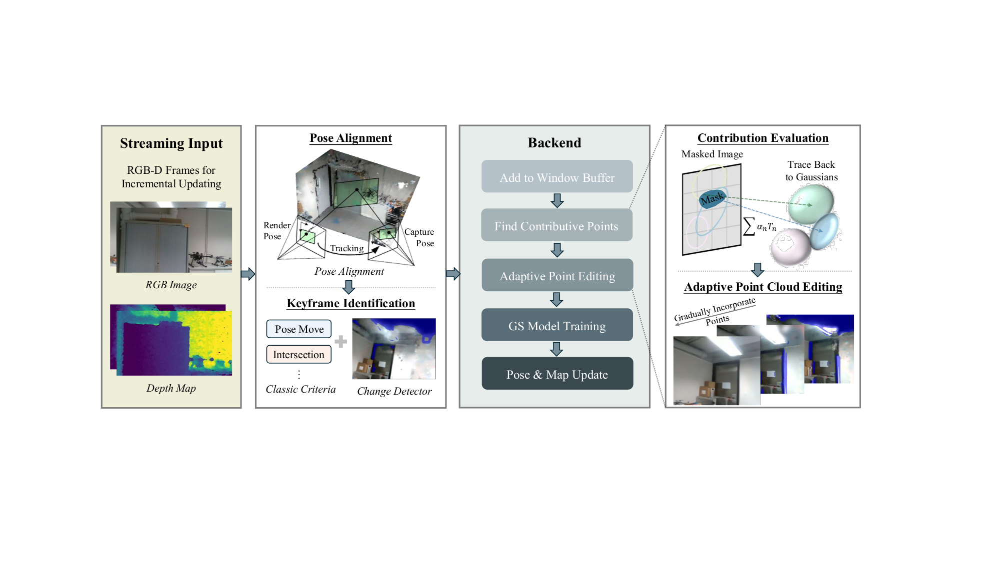
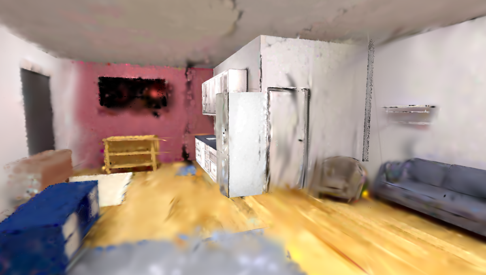
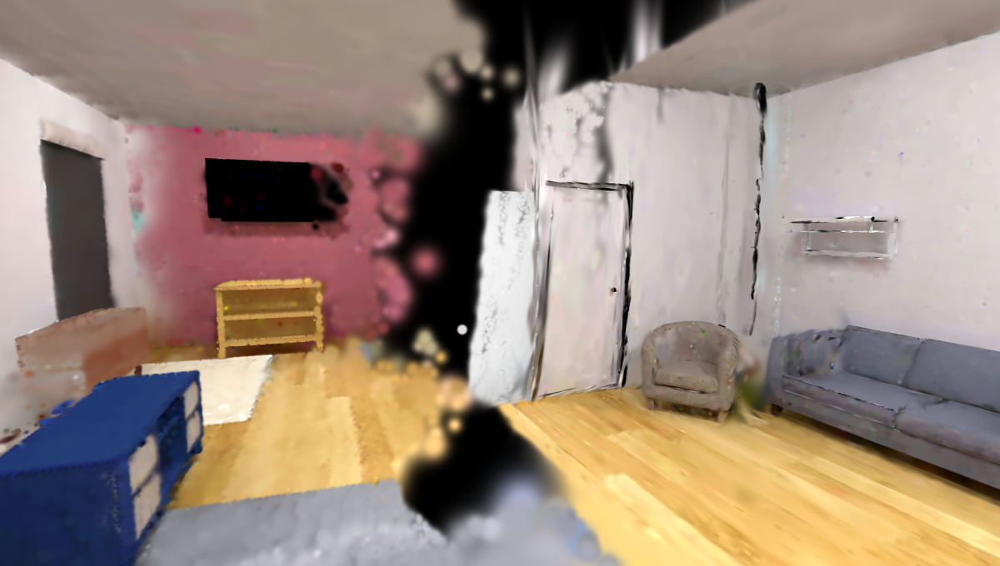
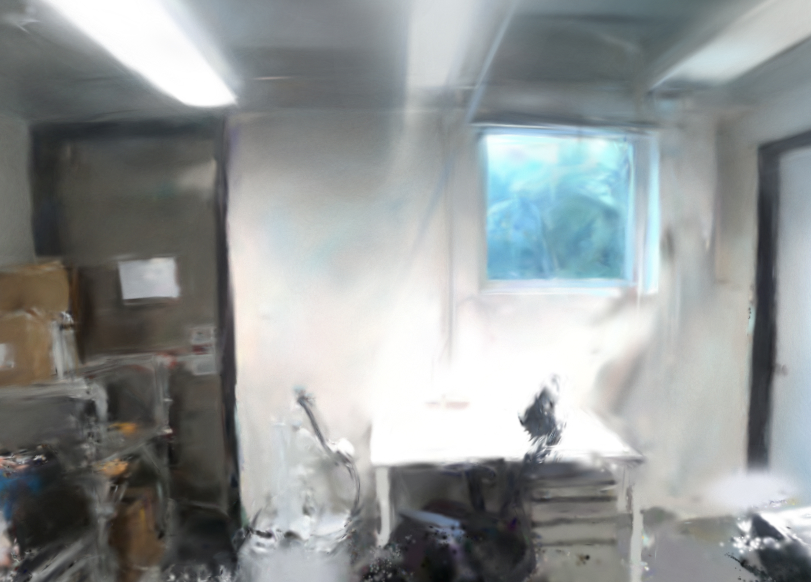
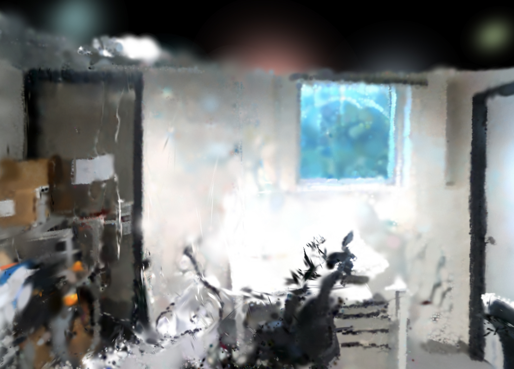
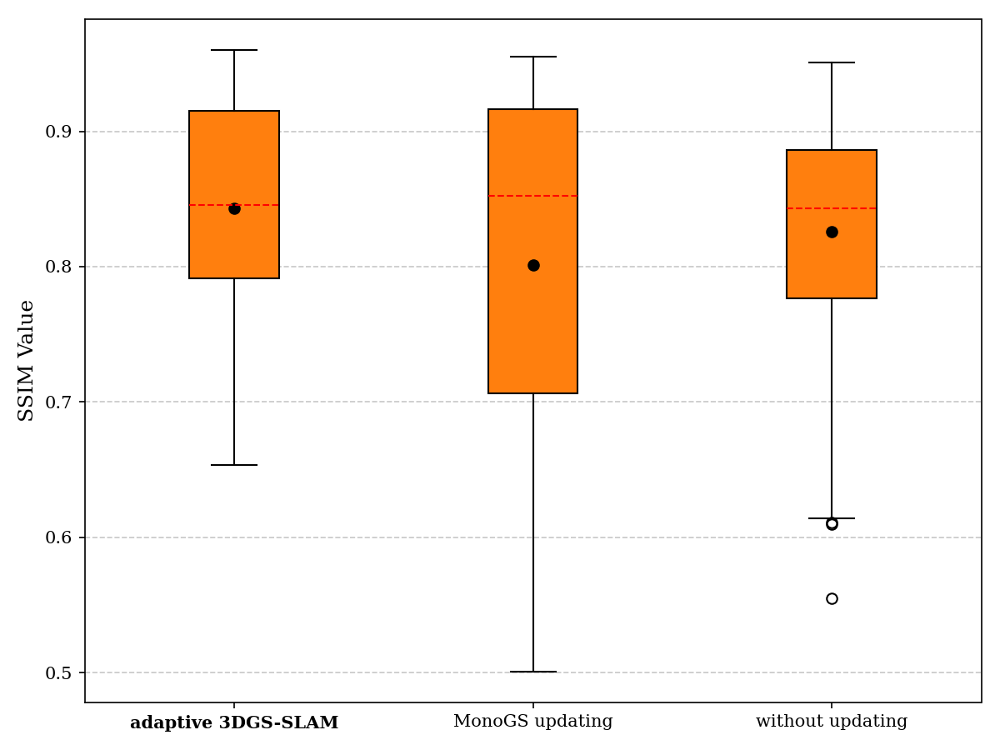

<div align="center">

# TwinSplat

### Adaptive 3DGS-SLAM-Driven Incremental Online Geometric Digital Twinning of Complex Indoor Built Environments

Ye Yuan<sup>1</sup> · Long Chen<sup>1,✉</sup> · Qiuchen Lu<sup>2</sup> · Thomas Shiu Tong Ng<sup>1</sup> · Hongyang Li<sup>3</sup> · Shanjing Zhou<sup>4</sup>

<sup>1</sup> City University of Hong Kong &nbsp;·&nbsp; <sup>2</sup> The Bartlett, UCL &nbsp;·&nbsp; <sup>3</sup> Hohai University &nbsp;·&nbsp; <sup>4</sup> CEGE, UCL

<sup>✉</sup> Corresponding author: `longchen@cityu.edu.hk`

<br>


**Localized updates · Catastrophic-forgetting-free · Real-time incremental digital twins**

</div>

---

## Overview

Digital twins of indoor built environments must stay synchronized with the physical space as furniture is rearranged, equipment is replaced, and rooms are reconfigured between inspections. Existing 3D reconstruction pipelines either **re-scan and rebuild from scratch** (prohibitively expensive) or **naively fine-tune** the model, which triggers *catastrophic forgetting* and *visual tearing* in unchanged regions.

**TwinSplat** is an adaptive **3D Gaussian Splatting–SLAM** framework for *incremental online* geometric digital twinning. Given a pre-built baseline 3DGS model and a new RGB-D scan stream from routine inspection, it detects **only the regions that actually changed** and edits **only the Gaussian primitives responsible for those changes** — keeping the rest of the scene intact while running in real time.

<div align="center">

<br>
<em>The four-stage adaptive pipeline: pose alignment → SSIM change detection & keyframe selection → parallel Gaussian contribution evaluation → adaptive point-cloud editing.</em>
</div>

---

## Main Contributions

1. **Four-Stage Adaptive 3DGS-SLAM Framework.** A unified pipeline of *visual alignment*, *SSIM-based change detection*, *parallel Gaussian contribution evaluation*, and *adaptive point-cloud editing* that prevents visual tearing and mitigates catastrophic forgetting during incremental updates.

2. **Selective Gaussian Modification.** Instead of updating the whole model, only the Gaussians tied to detected local changes are edited — cutting average keyframe mapping time by **70%** and total per-frame time by **57%** (synthetic) / **21.5%** (real world), with **no** loss in reconstruction quality.

3. **Incremental Updating with Geometric Preservation.** Streaming data is integrated continuously while unchanged geometry is protected; **~70%** of the final Gaussian primitives are preserved from the baseline model, keeping the scene complete even under partial scan coverage.

---

## Key Results

### Handling changes without forgetting

When new scans cover only part of a room, naively updating with MonoGS corrupts previously reconstructed areas. TwinSplat updates the changed furniture while preserving the static background.

<div align="center">
<table>
<tr>
<td align="center"><b>TwinSplat (Ours)</b></td>
<td align="center"><b>Update with MonoGS</b></td>
</tr>
<tr>
<td></td>
<td></td>
</tr>
<tr>
<td align="center"><em>Static regions preserved, change integrated</em></td>
<td align="center"><em>Catastrophic forgetting & artifacts</em></td>
</tr>
</table>
</div>

### Real-world scene — novel-view rendering

In a real laboratory scan, rendering the baseline model from a novel viewpoint exposes rendering voids where geometry is incomplete. The adaptive update fills these regions and renders cleanly.

<div align="center">
<table>
<tr>
<td align="center"><b>TwinSplat (Ours)</b></td>
<td align="center"><b>Baseline — no update</b></td>
</tr>
<tr>
<td></td>
<td></td>
</tr>
</table>
</div>

### Quantitative comparison — ReplicaCAD test views

| Method | Test SSIM ↑ | Test PSNR ↑ | ATE RMSE [m] ↓ | Avg. Time [s] ↓ |
|:--|:--:|:--:|:--:|:--:|
| **TwinSplat (Ours)** | **0.7542** | **19.48** | 0.1054 | 1.162 |
| Update w/ MonoGS | 0.6537 | 13.98 | 0.1109 | 2.730 |
| Rebuild w/ SplaTAM | 0.6834 | 13.39 | **0.0086** | 5.988 |
| Rebuild w/ Photo-SLAM | 0.7339 | 15.14 | 0.0400 | 0.040 * |
| Rebuild w/ GS-ICP-SLAM | 0.5810 | 9.04 | 1.0764 | 0.085 * |

<sub>\* C++ / hybrid C++–Python multi-process implementations; all Python baselines run single-thread for a fair comparison.</sub>

- **vs. MonoGS baseline:** +15% test-view SSIM and **−57% average processing time** on ReplicaCAD.
- **Real-world case study:** SSIM **0.84** / PSNR **23.37 dB**, a **+5% SSIM** and **−21.5% per-frame time** vs. the classic MonoGS updating pipeline — with **zero** catastrophic-forgetting or visual-tearing failures across all test frames.

<div align="center">

<br>
<em>SSIM distribution across all test frames — TwinSplat stays consistently high with a narrow spread, while MonoGS shows large variability and outliers down to ~0.5.</em>
</div>

---

## Source Code

> 🚧 **Source code will be released here soon.** We are cleaning up and documenting the implementation for public release. Star ⭐ / watch 👀 this repository to be notified.

Planned release:
- [ ] Core adaptive 3DGS-SLAM pipeline (tracking, change detection, adaptive editing)
- [ ] Pretrained baseline models & example scans
- [ ] Evaluation scripts (SSIM / PSNR / ATE) and configs
- [ ] Setup instructions and dependencies

---

## Citation

If you find this work useful, please consider citing (bibliographic details will be finalized upon publication):

```bibtex
@article{yuan2026twinsplat,
  title   = {Adaptive 3DGS-SLAM-Driven Incremental Online Geometric Digital
             Twinning of Complex Indoor Built Environments},
  author  = {Yuan, Ye and Chen, Long and Lu, Qiuchen and Ng, Thomas Shiu Tong
             and Li, Hongyang and Zhou, Shanjing},
  journal = {Advanced Engineering Informatics},
  year    = {2026},
  note    = {Under review}
}
```

---

## Acknowledgements

This work builds upon the open-source community, in particular
[MonoGS](https://github.com/muskie82/MonoGS),
[3D Gaussian Splatting](https://github.com/graphdeco-inria/gaussian-splatting),
[SplaTAM](https://github.com/spla-tam/SplaTAM),
[Photo-SLAM](https://github.com/HuajianUP/Photo-SLAM), and
[GS-ICP-SLAM](https://github.com/Lab-of-AI-and-Robotics/GS_ICP_SLAM).
We thank the authors for releasing their code.
