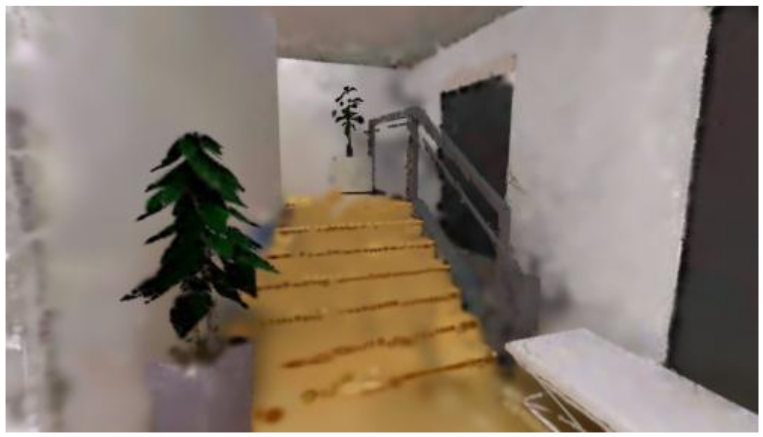
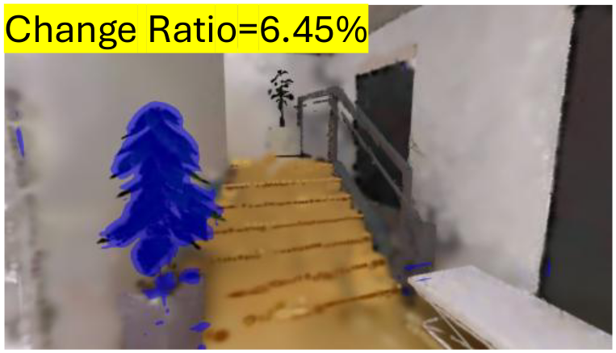
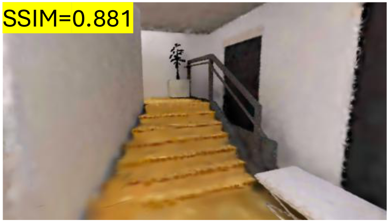
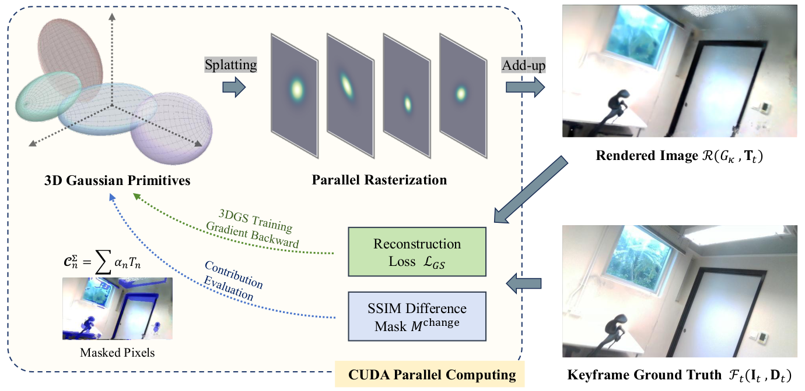
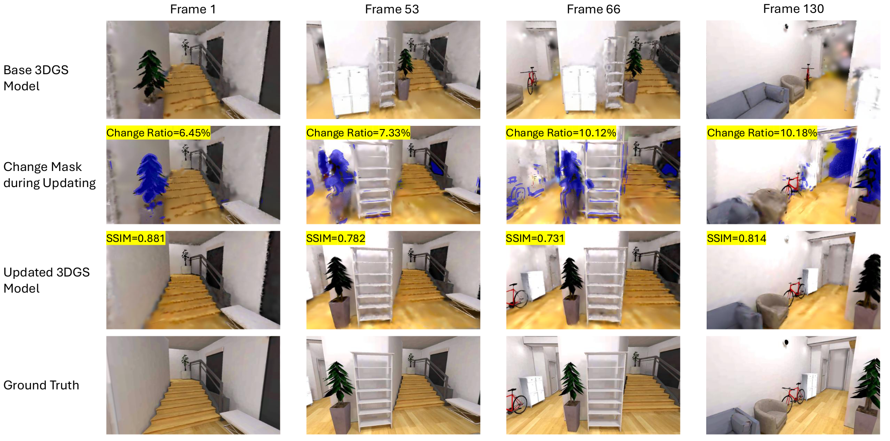

<div align="center">

# TwinSplat

### Adaptive 3DGS-SLAM-Driven Incremental Online Geometric Digital Twinning Complex Indoor Built Environments

Ye Yuan<sup>1</sup> · Long Chen<sup>1,✉</sup> · Qiuchen Lu<sup>2</sup> · Thomas Shiu Tong Ng<sup>1</sup> · Hongyang Li<sup>3</sup> · Shanjing Zhou<sup>2</sup>

<sup>1</sup> City University of Hong Kong &nbsp;·&nbsp; <sup>2</sup> University College London &nbsp;·&nbsp; <sup>3</sup> Hohai University

<sup>✉</sup> Corresponding author `longchen@cityu.edu.hk`

<br>


</div>

---

## Overview

Digital twins of indoor built environments must stay synchronized with the physical space as furniture is rearranged, equipment is replaced, and rooms are reconfigured between inspections. Existing 3D reconstruction pipelines either **re-scan and rebuild from scratch** (prohibitively expensive) or **naively fine-tune** the model, which triggers *catastrophic forgetting* and *visual tearing* in unchanged regions.

**TwinSplat** is an adaptive **3D Gaussian Splatting-SLAM** framework for *incremental online* geometric digital twinning. Given a pre-built baseline 3DGS model and a new RGB-D scan stream from routine inspection, it detects **only the regions that actually changed** and edits **only the Gaussian primitives responsible for those changes**, keeping the rest of the scene intact as new data streams in.

<div align="center">

<br>
<em>The four-stage adaptive pipeline. Pose alignment → SSIM change detection and keyframe selection → parallel Gaussian contribution evaluation → adaptive point-cloud editing.</em>
</div>

---

## Main Contributions

1. **Four-Stage Adaptive 3DGS-SLAM Framework.** A unified pipeline of *visual alignment*, *SSIM-based change detection*, *parallel Gaussian contribution evaluation*, and *adaptive point-cloud editing* that prevents visual tearing and mitigates catastrophic forgetting during incremental updates.

2. **Selective Gaussian Modification.** Instead of updating the whole model, only the Gaussians tied to detected local changes are edited. This cuts average keyframe mapping time by **70%** and total per-frame time by **57%** (synthetic) or **21.5%** (real world), with **no** loss in reconstruction quality.

3. **Incremental Updating with Geometric Preservation.** Streaming data is integrated continuously while unchanged geometry is protected, and about **70%** of the final Gaussian primitives are preserved from the baseline model, keeping the scene complete even under partial scan coverage.

---

## How It Works

The core idea is simple. **Compare first, then edit only what changed.** For each incoming frame, TwinSplat renders the current 3DGS model at the tracked camera pose and compares it against the freshly captured image. A sliding-window **SSIM** detector marks the pixels that differ, and this change mask is traced back through the Gaussian rasterizer to find exactly which Gaussian primitives are responsible. Only those primitives are pruned and re-optimized with the new observation, while everything else stays frozen. This is what makes the update both fast and free of catastrophic forgetting.

<div align="center">
<table>
<tr>
<td align="center"><b>① Baseline render</b></td>
<td align="center"><b>② Change detected</b></td>
<td align="center"><b>③ Updated model</b></td>
</tr>
<tr>
<td></td>
<td></td>
<td></td>
</tr>
</table>
<em>One update step on a ReplicaCAD frame. The baseline model still renders the old potted plant (①). The SSIM detector flags exactly that region as changed (②, 6.45% of pixels, shown in blue). After editing only the responsible Gaussians, the updated model no longer shows the stale plant and reaches SSIM 0.881 against the new capture (③).</em>
</div>

The contribution evaluation and editing run inside the Gaussian rasterizer, so they inherit the same CUDA parallelization as standard 3DGS training and add little overhead. The change mask is passed into the backward pass to score how strongly each Gaussian influences the changed pixels, and only the high-scoring primitives are edited.

<div align="center">

<br>
<em>Backend of the adaptive pipeline. Gaussians are splatted and rasterized in parallel into the rendered image, which is compared with the keyframe ground truth to form the reconstruction loss and the SSIM difference mask. The mask then drives a contribution evaluation that identifies which Gaussians to edit, all within CUDA.</em>
</div>

### The updating process across a sequence

<div align="center">

<br>
<em>Incremental updating over frames 1–130. From top to bottom, the rows show the baseline model render, the detected change mask (blue) with its change ratio, the model after adaptive editing with per-frame SSIM, and the ground truth. Only the regions flagged in the change mask are touched, so relocated objects such as the potted plant, storage shelf, and bicycle are integrated while the rest of the scene is preserved.</em>
</div>

---

## Key Results

### Handling changes without forgetting

When new scans cover only part of a room, naively updating with MonoGS corrupts previously reconstructed areas. TwinSplat updates the changed furniture while preserving the static background.

<div align="center">
<table>
<tr>
<td align="center"><b>TwinSplat (Ours)</b></td>
<td align="center"><b>Update with MonoGS</b></td>
</tr>
<tr>
<td></td>
<td></td>
</tr>
<tr>
<td align="center"><em>Static regions preserved, change integrated</em></td>
<td align="center"><em>Catastrophic forgetting and artifacts</em></td>
</tr>
</table>
</div>

### Novel-view rendering on a real scene

In a real laboratory scan, rendering the baseline model from a novel viewpoint exposes rendering voids where geometry is incomplete. The adaptive update fills these regions and renders cleanly.

<div align="center">
<table>
<tr>
<td align="center"><b>TwinSplat (Ours)</b></td>
<td align="center"><b>Baseline (no update)</b></td>
</tr>
<tr>
<td></td>
<td></td>
</tr>
</table>
</div>

### Quantitative comparison on ReplicaCAD test views

| Method | Test SSIM ↑ | Test PSNR ↑ | ATE RMSE [m] ↓ | Avg. Time [s] ↓ |
|:--|:--:|:--:|:--:|:--:|
| **TwinSplat (Ours)** | **0.7542** | **19.48** | 0.1054 | 1.162 |
| Update w/ MonoGS | 0.6537 | 13.98 | 0.1109 | 2.730 |
| Rebuild w/ SplaTAM | 0.6834 | 13.39 | **0.0086** | 5.988 |
| Rebuild w/ Photo-SLAM | 0.7339 | 15.14 | 0.0400 | 0.040 * |
| Rebuild w/ GS-ICP-SLAM | 0.5810 | 9.04 | 1.0764 | 0.085 * |

<sub>\* C++ or hybrid C++/Python multi-process implementations; all Python baselines run single-thread for a fair comparison.</sub>

- Against the **MonoGS baseline**, TwinSplat improves test-view SSIM by **15%** and lowers average processing time by **57%** on ReplicaCAD.
- In the **real-world case study**, it reaches SSIM **0.84** and PSNR **23.37 dB**, a **5%** SSIM gain and **21.5%** less per-frame time than the classic MonoGS updating pipeline, with **zero** catastrophic-forgetting or visual-tearing failures across all test frames.

---

## Source Code

> 🚧 **Source code will be released here soon.** We are cleaning up and documenting the implementation for public release. Star ⭐ / watch 👀 this repository to be notified.

Planned release.
- [ ] Core adaptive 3DGS-SLAM pipeline (tracking, change detection, adaptive editing)
- [ ] Pretrained baseline models and example scans
- [ ] Evaluation scripts (SSIM, PSNR, ATE) and configs
- [ ] Setup instructions and dependencies

---

## Citation

If you find this work useful, please consider citing it. Volume and page details will be added once the article is in press.

```bibtex
@article{yuan2026twinsplat,
  title   = {Adaptive 3DGS-SLAM-Driven Incremental Online Geometric Digital
             Twinning Complex Indoor Built Environments},
  author  = {Yuan, Ye and Chen, Long and Lu, Qiuchen and Ng, Thomas Shiu Tong
             and Li, Hongyang and Zhou, Shanjing},
  journal = {Advanced Engineering Informatics},
  year    = {2026},
  note    = {Accepted}
}
```

---

## Acknowledgements

This work builds upon the open-source community, in particular
[MonoGS](https://github.com/muskie82/MonoGS),
[3D Gaussian Splatting](https://github.com/graphdeco-inria/gaussian-splatting),
[SplaTAM](https://github.com/spla-tam/SplaTAM),
[Photo-SLAM](https://github.com/HuajianUP/Photo-SLAM), and
[GS-ICP-SLAM](https://github.com/Lab-of-AI-and-Robotics/GS_ICP_SLAM).
We thank the authors for releasing their code.
